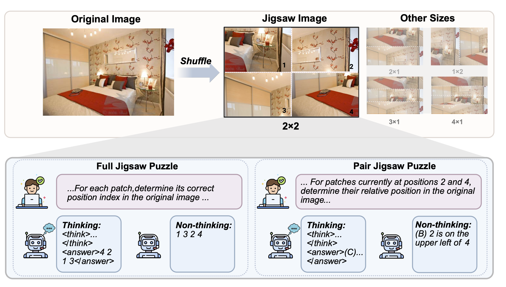
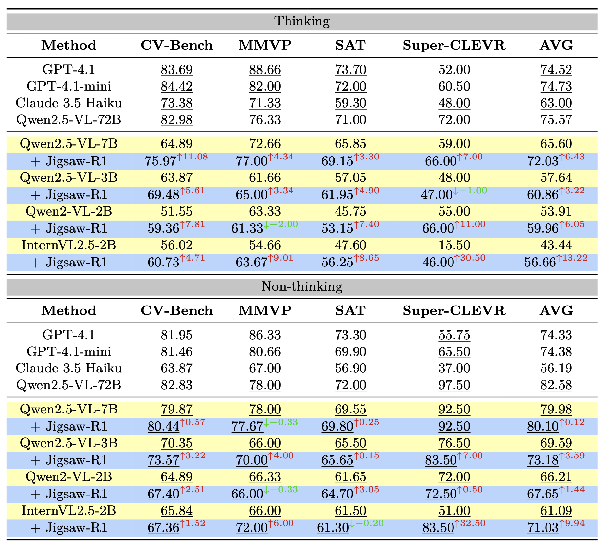

<h1 align="center"><a style="color:#9C276A">
Jigsaw-R1: A Study of Rule-based Visual Reinforcement Learning with Jigsaw Puzzles</a></h1>

<h5 align="center">
 
[](https://arxiv.org/abs/2505.23590) 
[](https://huggingface.co/jigsaw-r1)

## Task Design
An original image is divided into an $m$ × $n$ grid of patches, which are then randomly shuffled to create the jigsaw image. We consider two question types (full or pair) and two prompting strategies (thinking or non-thinking).

<table>
 <tr>
  <td width="100%">
   
  </td>
 </tr>
</table>

## Main Results
Using jigsaw puzzles as our experimental framework, this research undertakes an in-depth exploration of multifaceted aspects within rule-based visual RL. Our investigation yields findings that address the following key research questions and we would like to specifically highlight the generalization capabilities of MLLMs trained with jigsaw puzzles. 

<details>
<summary>Research Question #1: How do contemporary MLLMs perform on the classic pretext task of jigsaw puzzles?</summary>
Without task-specific training, the performance of contemporary MLLMs on the simplest jigsaw puzzles (i.e., 2x1) is comparable to random guessing. However, fine-tuning enables these models to effectively solve such puzzles with near-perfect accuracy. Importantly, these learned abilities generalize to more complex configurations (e.g., 3x1) not encountered during training.
</details>

<details>
<summary>Research Question #2: Can MLLMs trained to solve jigsaw puzzles develop generalizable abilities applicable to other visual tasks?</summary>
Training models on jigsaw puzzles enables generalization to downstream tasks. The effectiveness of this generalization is dependent on specific task configurations, including puzzle size, question type and training dataset.
</details>

<details>
<summary>Research Question #3: Given that extended reasoning may be detrimental for some perceptual tasks, is an explicit thinking process still beneficial when employing rule-based visual RL to solve jigsaw puzzles?</summary>
MLLMs can learn and generalize with or without an explicit reasoning process. However, open-source MLLMs typically show stronger performance in direct answering. As a result, even when trained to employ step-by-step reasoning, they tend to disregard the thinking process in deriving the final answer.
</details>

<details>
<summary>Research Question #4: Considering that many visual tasks can be solved with concise outputs, does the aha moment still emerge in MLLMs trained on jigsaw puzzles?</summary>
The aha moment, characterized by the sudden emergence of complex reasoning patterns, is not observed. Instead, these patterns are pre-existing within MLLMs and are readily elicited by tasks with inherent reasoning structures, like jigsaw puzzles. Furthermore, the frequency of these reasoning patterns demonstrably increases throughout training and in response to greater task difficulty.
</details>

<details>
<summary>Research Question #5: How does supervised fine-tuning (SFT) compare with RL in terms of generalization?</summary>
SFT generally demonstrates less effective generalization compared to RL. Besides, initiating training with a SFT cold start phase can make later RL optimization less effective.
</details>

<table>
 <tr>
  <td width="100%">
   
  </td>
 </tr>
</table>

## Prerequisites
### Hardware
Our experiments are conducted on 8 x 64GB AMD MI250X GPUs. If you are using fewer GPUs or GPUs with less memory, consider the following adjustments to manage memory constraints:
- Set `--gradient_checkpointing` to `True`
- Change `--deepspeed` to use `configs/zero3.json`
- Decrease `--per_device_train_batch_size`

**Note:** To reproduce our results, the effective batch size should remain 512. This is calculated as: `number_of_gpus` * `per_device_train_batch_size` * `gradient_accumulation_steps`.

### Datasets
The test datasets are available at [🤗 Jigsaw-R1](https://huggingface.co/jigsaw-r1).

For the training data, please follow these instructions:
* Download `train2014` images from the [COCO dataset](http://images.cocodataset.org/zips/train2014.zip)
* Organize your `data_dir` as follows, placing the `train2014` folder and the [train2014.json](data/train2014.json) file accordingly
```
data_dir/
└── coco/
    ├── train2014/
    │   ├── *.jpg
    │   └── ...
    └── train2014.json
```

### Models
[🤗 jigsaw-r1/jigsaw_pair_2x1_think](https://huggingface.co/jigsaw-r1/jigsaw_pair_2x1_think): Qwen2.5-VL-3B-Instruct trained with 2x1 pair jigsaw puzzles (thinking).

[🤗 jigsaw-r1/jigsaw_pair_2x1_nothink](https://huggingface.co/jigsaw-r1/jigsaw_pair_2x1_nothink): Qwen2.5-VL-3B-Instruct trained with 2x1 pair jigsaw puzzles (non-thinking).


## Train
<details>
<summary>Train on a single jigsaw puzzle size</summary>
This script demonstrates how to train Qwen2.5-VL-3B (non-thinking) on a single jigsaw puzzle size (i.e., 2x1).

```bash
python -m torch.distributed.run \
  --nnodes="1" \
  --nproc_per_node="8" \
  --node_rank="0" \
  --master_addr="127.0.0.1" \
  --master_port="12346" \
  grpo.py \
  --data_dir $DATA_DIR \
  --output_dir $OUTPUT_DIR \
  --deepspeed configs/zero2.json \
  --model_name_or_path Qwen/Qwen2.5-VL-3B-Instruct \
  --instruct_model \
  --dataset_name coco \
  --m 2 2 \
  --n 1 1 \
  --stage 99999999 99999999 \
  --question_type "pair" \
  --no-think \
  --num_generations 8 \
  --per_device_train_batch_size 4 \
  --gradient_accumulation_steps 16 \
  --logging_steps 1 \
  --bf16 \
  --report_to wandb \
  --gradient_checkpointing false \
  --attn_implementation flash_attention_2 \
  --max_steps 2000 \
  --run_name $RUN_NAME \
  --save_steps 200
```
</details>

<details>
<summary>Train on multiple jigsaw puzzle sizes</summary>
The following script demonstrates training Qwen2.5-VL-3B (non-thinking) in a curriculum learning setting. It first trains on 3x1 jigsaw puzzles for 1,000 steps and then continues training on 4x1 jigsaw puzzles for an additional 1,000 steps.

**Note:** One training step processes 64 unique prompts.

```bash
python -m torch.distributed.run \
  --nnodes="1" \
  --nproc_per_node="8" \
  --node_rank="0" \
  --master_addr="127.0.0.1" \
  --master_port="12346" \
  grpo.py \
  --data_dir $DATA_DIR \
  --output_dir $OUTPUT_DIR \
  --deepspeed configs/zero2.json \
  --model_name_or_path Qwen/Qwen2.5-VL-3B-Instruct \
  --instruct_model \
  --dataset_name coco \
  --m 3 4 \
  --n 1 1 \
  --stage 64000 99999999 \
  --question_type "pair" \
  --no-think \
  --num_generations 8 \
  --per_device_train_batch_size 4 \
  --gradient_accumulation_steps 16 \
  --logging_steps 1 \
  --bf16 \
  --report_to wandb \
  --gradient_checkpointing false \
  --attn_implementation flash_attention_2 \
  --max_steps 2000 \
  --run_name $RUN_NAME \
  --save_steps 200
```
</details>

## Test
<details>
<summary>Test on jigsaw puzzles</summary>
Use this script to evaluate a model on jigsaw puzzle tasks.

```bash
python test.py \
  --model_path $MODEL_PATH \
  --no-think \
  --dataset_name "coco" \
  --dataset_split "test" \
  --output_dir $OUTPUT_DIR \
  --jigsaw \
  --m 2 \
  --n 1 \
  --question_type "pair"
```

Alternatively, the following Python script prepares jigsaw puzzle tasks in QA format, ready for processing within your own codebase.

```python
from utils.utils import create_input_helper

inputs = create_input_helper(
    dataset_name="coco",
    dataset_split="test",
    dataset_size=-1,
    jigsaw=True,
    jigsaw_seed=0,
    m=2,
    n=1,
    n_c=4,
    shuffle_mn=True,
    mask_ratio=0,
    width_min=0.1,
    width_max=0.6,
    height_min=0.1,
    height_max=0.6,
    forward=True,
    question_type="pair",
    think=False,
    instruct_model=True
)
```
</details>

<details>
<summary>Test on downstream tasks</summary>
Use this script to evaluate a model on downstream tasks.

```bash
python test.py \
  --model_path $MODEL_PATH \
  --no-think \
  --dataset_name "cv_bench" \
  --dataset_split "test" \
  --no-jigsaw
```

Alternatively, the following Python script prepares downstream tasks in QA format, ready for processing within your own codebase.

```python
from utils.utils import create_input_helper

inputs = create_input_helper(
    dataset_name="cv_bench",
    dataset_split="test",
    dataset_size=-1,
    jigsaw=False,
    jigsaw_seed=0,
    m=2,
    n=1,
    n_c=4,
    shuffle_mn=True,
    mask_ratio=0,
    width_min=0.1,
    width_max=0.6,
    height_min=0.1,
    height_max=0.6,
    forward=True,
    question_type="pair",
    think=False,
    instruct_model=True
)
```
</details>

## Acknowledgements
* [trl](https://github.com/huggingface/trl)
* [VLM-R1](https://github.com/om-ai-lab/VLM-R1)

## Citation
```BibTeX
@artile{wang2025jigsawr1,
  title={Jigsaw-R1: A Study of Rule-based Visual Reinforcement Learning with Jigsaw Puzzles}, 
  author={Wang, Zifu and Zhu, Junyi and Tang, Bo and Li, Zhiyu and Xiong, Feiyu and Yu, Jiaqian and Blaschko, Matthew B.},
  journal={TMLR},
  year={2025}
}
```
