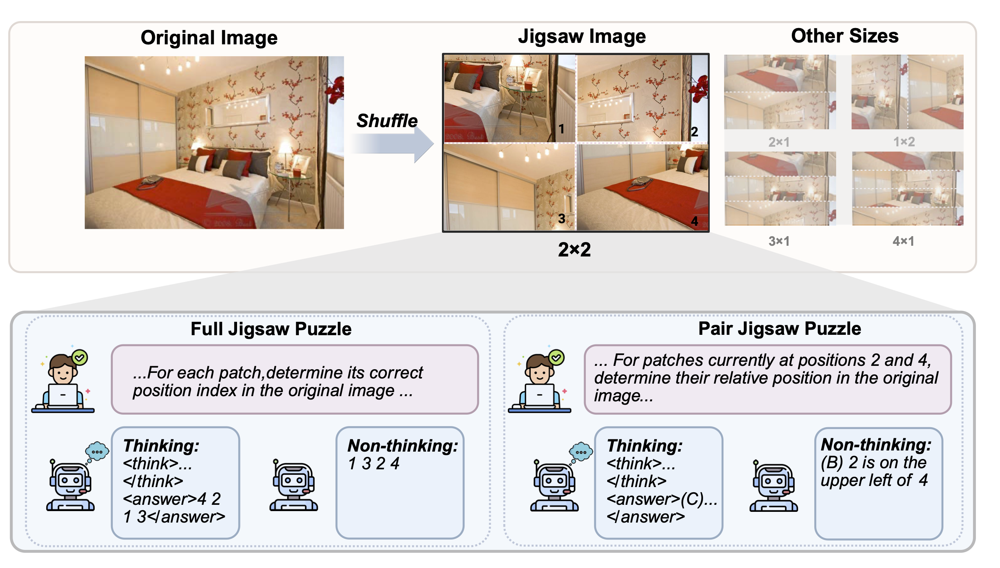

# Jigsaw-R1: A Study of Rule-based Visual Reinforcement Learning with Jigsaw Puzzles

<table>
 <tr>
  <td width="100%">
   
  </td>
 </tr>
</table>

## Prerequisites
### Hardware
Our experiments are conducted on 8 x 64GB AMD MI250X GPUs. If you are using fewer GPUs or GPUs with less memory, consider the following adjustments to manage memory constraints:
- Set `--gradient_checkpointing` to `True`
- Change `--deepspeed` to use `configs/zero3.json`
- Decrease `--per_device_train_batch_size`.

**Note:** To reproduce our results, the effective batch size should remain 512. This is calculated as: `number_of_gpus` * `per_device_train_batch_size` * `gradient_accumulation_steps`

### Dataset
The test dataset is available at [🤗 Jigsaw-R1](https://huggingface.co/jigsaw-r1).

For the training data, please follow these instructions:
* Download `train2014` images from the [COCO dataset](http://images.cocodataset.org/zips/train2014.zip)
* Organize your `data_dir` as follows, placing the `train2014` folder and the [train2014.json](data/train2014.json) file accordingly
```
data_dir/
└── coco/
    ├── train2014/
    │   ├── *.jpg
    │   └── ...
    └── train2014.json
```

## Train
<details>
<summary>Train on a single jigsaw puzzle size</summary>
This script demonstrates how to train Qwen2.5-VL-3B (non-thinking) on a single jigsaw puzzle size (i.e., 2x1).

```bash
python -m torch.distributed.run \
  --nnodes="1" \
  --nproc_per_node="8" \
  --node_rank="0" \
  --master_addr="127.0.0.1" \
  --master_port="12346" \
  grpo.py \
  --data_dir $DATA_DIR \
  --output_dir $OUTPUT_DIR \
  --deepspeed configs/zero2.json \
  --model_name_or_path Qwen/Qwen2.5-VL-3B-Instruct \
  --instruct_model \
  --dataset_name coco \
  --m 2 2 \
  --n 1 1 \
  --stage 99999999 99999999 \
  --question_type "pair" \
  --no-think \
  --num_generations 8 \
  --per_device_train_batch_size 4 \
  --gradient_accumulation_steps 16 \
  --logging_steps 1 \
  --bf16 \
  --report_to wandb \
  --gradient_checkpointing false \
  --attn_implementation flash_attention_2 \
  --max_steps 2000 \
  --run_name $RUN_NAME \
  --save_steps 200
```
</details>

<details>
<summary>Train on multiple jigsaw puzzle sizes</summary>
The following script demonstrates training Qwen2.5-VL-3B (non-thinking) in a curriculum learning setting. It first trains on 3x1 jigsaw puzzles for 1,000 steps and then continues training on 4x1 jigsaw puzzles for an additional 1,000 steps.

**Note:** One training step processes 64 unique prompts.

```bash
python -m torch.distributed.run \
  --nnodes="1" \
  --nproc_per_node="8" \
  --node_rank="0" \
  --master_addr="127.0.0.1" \
  --master_port="12346" \
  grpo.py \
  --data_dir $DATA_DIR \
  --output_dir $OUTPUT_DIR \
  --deepspeed configs/zero2.json \
  --model_name_or_path Qwen/Qwen2.5-VL-3B-Instruct \
  --instruct_model \
  --dataset_name coco \
  --m 3 4 \
  --n 1 1 \
  --stage 64000 99999999 \
  --question_type "pair" \
  --no-think \
  --num_generations 8 \
  --per_device_train_batch_size 4 \
  --gradient_accumulation_steps 16 \
  --logging_steps 1 \
  --bf16 \
  --report_to wandb \
  --gradient_checkpointing false \
  --attn_implementation flash_attention_2 \
  --max_steps 2000 \
  --run_name $RUN_NAME \
  --save_steps 200
```
</details>

## Test
<details>
<summary>Test on jigsaw puzzles</summary>
Use this script to evaluate a model on jigsaw puzzle tasks.

```bash
python test.py \
  --model_path $MODEL_PATH \
  --no-think \
  --dataset_name "coco" \
  --dataset_split "test" \
  --output_dir $OUTPUT_DIR \
  --jigsaw \
  --m 2 \
  --n 1 \
  --question_type "pair"
```

Alternatively, the following Python script prepares jigsaw puzzle tasks in QA format, ready for processing within your own codebase.

```python
from utils.utils import create_input_helper

inputs = create_input_helper(
    dataset_name="coco",
    dataset_split="test",
    dataset_size=-1,
    jigsaw=True,
    jigsaw_seed=0,
    m=2,
    n=1,
    n_c=4,
    shuffle_mn=True,
    mask_ratio=0,
    width_min=0.1,
    width_max=0.6,
    height_min=0.1,
    height_max=0.6,
    forward=True,
    question_type="pair",
    think=False,
    instruct_model=True
)
```
</details>

<details>
<summary>Test on downstream tasks</summary>
Use this script to evaluate a model on downstream tasks.

```bash
python test.py \
  --model_path $MODEL_PATH \
  --no-think \
  --dataset_name "cv_bench" \
  --dataset_split "test" \
  --no-jigsaw
```

Alternatively, the following Python script prepares downstream tasks in QA format, ready for processing within your own codebase.

```python
from utils.utils import create_input_helper

inputs = create_input_helper(
    dataset_name="cv_bench",
    dataset_split="test",
    dataset_size=-1,
    jigsaw=False,
    jigsaw_seed=0,
    m=2,
    n=1,
    n_c=4,
    shuffle_mn=True,
    mask_ratio=0,
    width_min=0.1,
    width_max=0.6,
    height_min=0.1,
    height_max=0.6,
    forward=True,
    question_type="pair",
    think=False,
    instruct_model=True
)
```
</details>

## Acknowledgements
* [trl](https://github.com/huggingface/trl)
* [VLM-R1](https://github.com/om-ai-lab/VLM-R1)

## Citation
```BibTeX
@artile{wang2025jigsawr1,
  title={Jigsaw-R1: A Study of Rule-based Visual Reinforcement Learning with Jigsaw Puzzles}, 
  author={Wang, Zifu and Zhu, Junyi and Tang, Bo and Li, Zhiyu and Xiong, Feiyu and Yu, Jiaqian and Blaschko, Matthew B.},
  journal={TMLR},
  year={2025},
}
```
